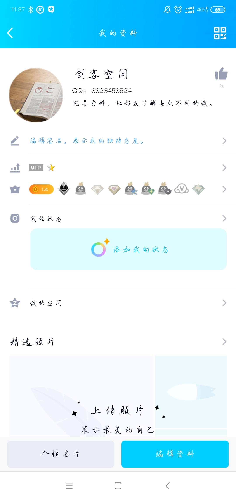
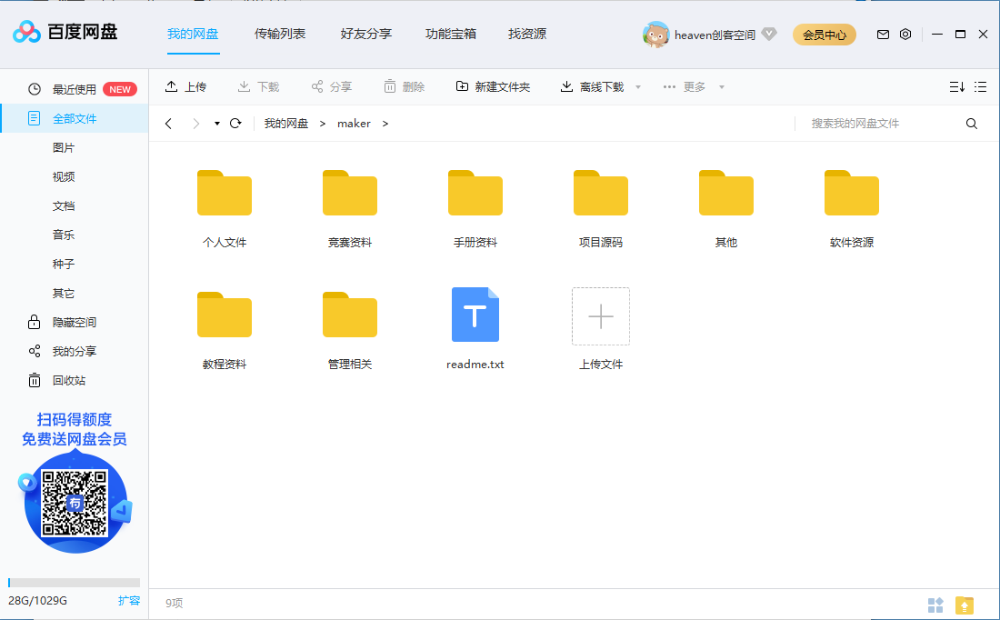
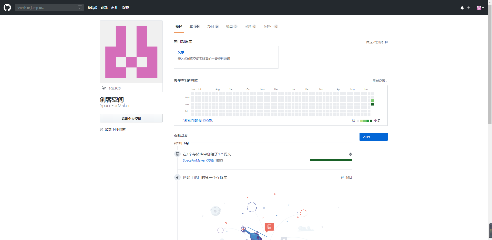
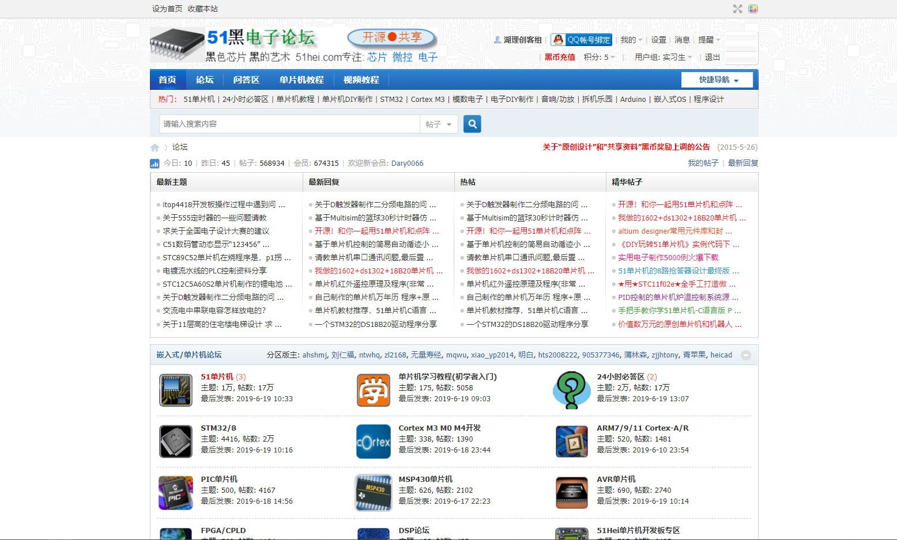

湖南理工学院创客空间
==========

QQ
----------------------------
 
3323453524 
chuangke5508 
从18届往后，每届新成员两个月后，上一届负责人提醒加次账号为好友 
   

百度网盘（以QQ账号登录）
---------------------
 
网盘作为空间的资源积累之一，相关的教资源程，原理图，数据手册，以及竞赛材料尽量保存好上传至此网盘，以供实验室后面的新成员查阅，学习。
网盘每个目录下有相应的readme.txt文件，上传资源前请先浏览，以便更好的进行资源分类。 
个人实验过程的项目源码，原理图上传前请先建好个人文件夹。 
   

github
------
 
spaceformaker@qq.com 
chuangke5508  
github主要用于项目代码托管，由于团队进行研发时的协作，本地请先安装git版本管理，了解git以及github的使用。 
   

51黑电子论坛
-----------
 
湖理创客组 
chuangke5508 
★每日登录有2黑币，使用账户内黑币下载资源后，请自觉连续登录补上，每消耗5黑币都三天，即补上6黑币 
   

负责人须知
---------
 
每届负责人需要对资源进行管理，以及更新资源说明文档

